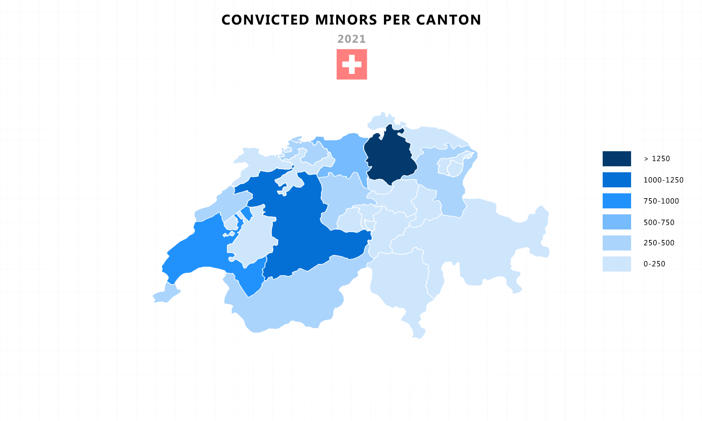
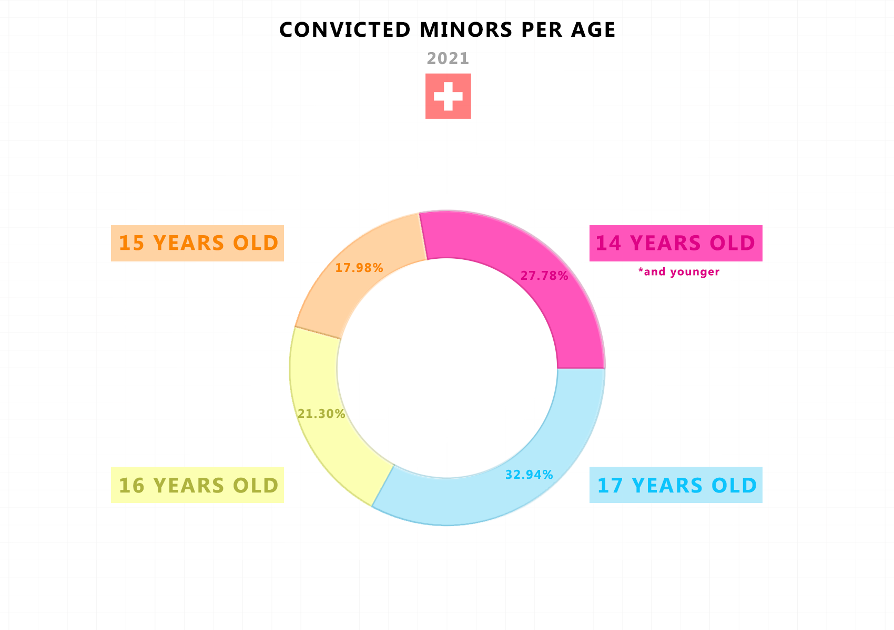
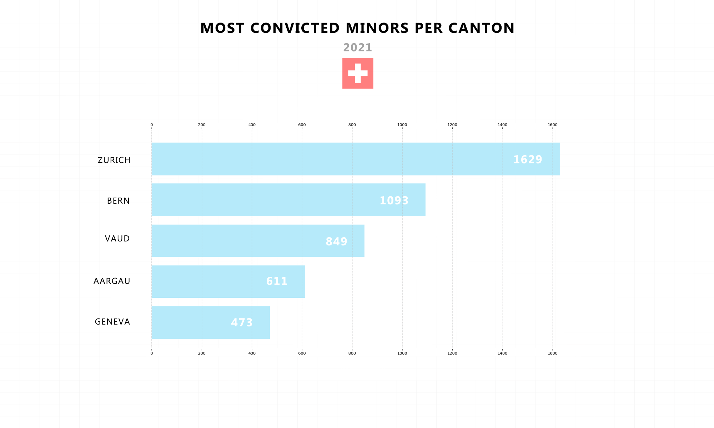
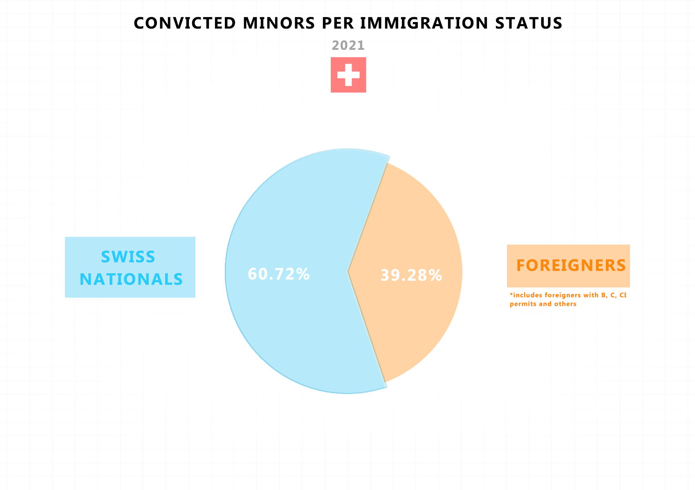

<strong>ABOUT</strong> 
 
This repo covers a descriptive analysis of convicted minors in Switzerland. Swiss crime rates are historically low and these numbers confirm that. But how do the numbers break down? 

<strong>WHAT HAVE I COVERED?</strong> 
 
1. Switzerland map with convicted minors per canton
2. Convicted minors per age
3. Convicted minors per gender
4. Convicted minors per immigration status
5. Top 5 cantons in convicted minors

<strong>NOTES</strong> 
 
I have included an original Swiss excell sheet as well as my own csv that was actually used to create the charts.
All charts included in assets folder 

<strong>SCREENSHOTS</strong>

